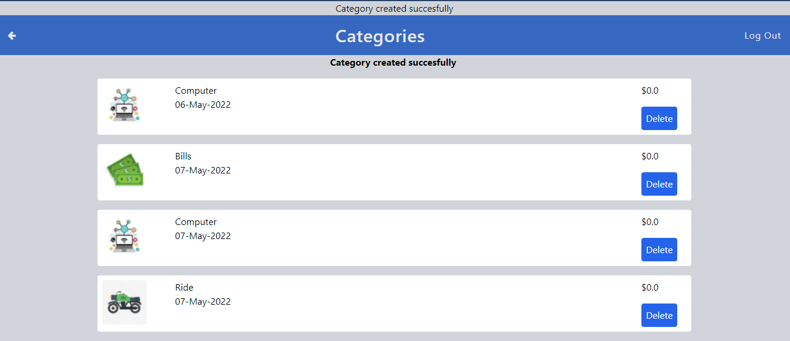

# Recipe-App

> This is a budget app with backend built using Ruby on Rails framework. It involves creating  item categories and transactions from those categories. The categories have a more detailed page for the specific transaction.




## Live Version

[ Video Documentation](https://www.loom.com/share/0523a75cbe7b42cca1e907c3b9d09b56)

[Live Demo](https://salty-retreat-04794.herokuapp.com/)

## Built With

- Ruby
- Ruby on Rails
- Tailwind
## Getting Started

- Getting a local copy is simple. Follow the steps below
### Install
- Ruby
- Ruby on Rails
- PostgresSQL
- Rspec
- Tailwindcss


### Local Copy

- Clone the project

```
https://github.com/chukwuemeka1234/Budget-app.git

cd Budget-app

```

### Setup

Install gems:

```
bundle install
```

Setup database:

```
rails db:create
rails db:migrate
```

### Usage

Start server:

```
rails server
```

Visit http://localhost:3000/ in your browser.

### Run tests

```
rspec
```
 
  ## Authors
👤 **Victor Chukwuemeka**

- GitHub: [@githubhandle](https://github.com/chukwuemeka1234/)
- Twitter: [@twitterhandle](https://twitter.com/@avc_victor)
- LinkedIn: [LinkedIn](https://www.linkedin.com/in/vic-chukwuemeka/)

## Credits

- The original design idea by [ Gregoire Vella on Behance](https://www.behance.net/gregoirevella)
- Icons inspired by [ Google ](www.google.com)

## 🤝 Contributing

Contributions, issues, and feature requests are welcome!

## Show your support

Give a ⭐️ if you like this project!
## 📝 License

This project is [MIT](lic.url) licensed.